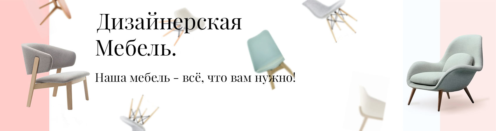
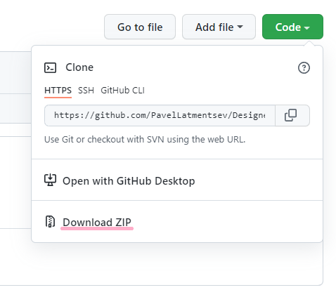
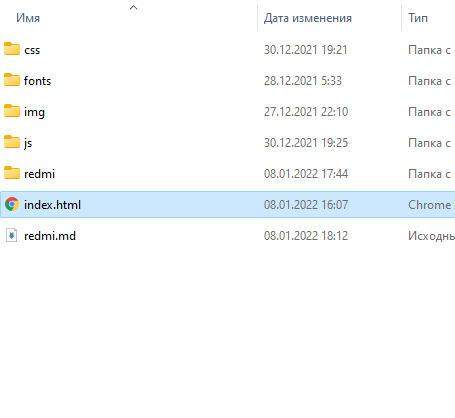

# DesignerFurniture
DesignerFurniture - Магазин дизайнерской мебели

### Наша мебель является уникальной. Используются только самые высококачественные материалы и уникальные технологии в производстве.  Мягкая мебель брэнда отличается эргономичными сиденьями и широкими возможностями регулировок для достижения максимального комфорта. Наш магазин - именно то что вам нужно.

# Как запустить наш проект.

1) [Зайти в репозиторий(<-------Нажать сюда)](https://github.com/PavelLatmentsev/DesignerFurniture.git).
2) [Скачать проект (<-------Нажать сюда)](https://github.com/PavelLatmentsev/DesignerFurniture/archive/refs/heads/main.zip) 
или нажать кнопку **Code** и выбрать **Download zip**.
 
      

3) Распаковать архив и открыть файл index.html через браузер.
   
   

# Используемые технологии в проекте

+ ### HTML - Разметка страницы -структура сайта.
+ ### CSS - Стили сайта.
+ ### БЭМ - технология Блок, Элемент, Модификатор.
+ ### JAVASCRIPT - Использован для работы слайдера.
+ ### JQUERY - Использован для работы слайдера.
+ ### [BURGER-MENU](https://www.youtube.com/watch?v=chJQofBSx94) - Адаптивное бургер меню сделанное на css,html и javascript.Было выполненно при помощи видео инструкции на **Youtube**.
+ ### [SLICK-SLIDER](https://kenwheeler.github.io/slick/) - В проекте используется слик слайдер в трёх секциях с различными настройками.

# Адаптивность
+ #### Проект тестировался на разрешениях 1920px,1440px,1024px,768px,425px,375px,320px.
+ #### Тестирование проходило в браузере Chrome версии 97.0.4692.71  и Mozilla Firefox версии 95.0.2 (64 бита).

# Проблемы с которыми пришлось столкнуться.
### В процессе работы столкнулся с проблемой в слайдере. Дело в том, что при формировании  слайдера, он устанавливает определенный блок с заданными параметрами. В проекте по макету при наведении на карточку товара появляется кнопка **"Купить"**. Так вот при добавлении карточек товара в слайдер, ховер эффект обрезается, и кнопку не видно. Пробовал переопределить стили у слайдера, но не помогло. Выходом стало увелечении области размера ссылки. По итогу кнопка появляется, но не так как в макете. ###

